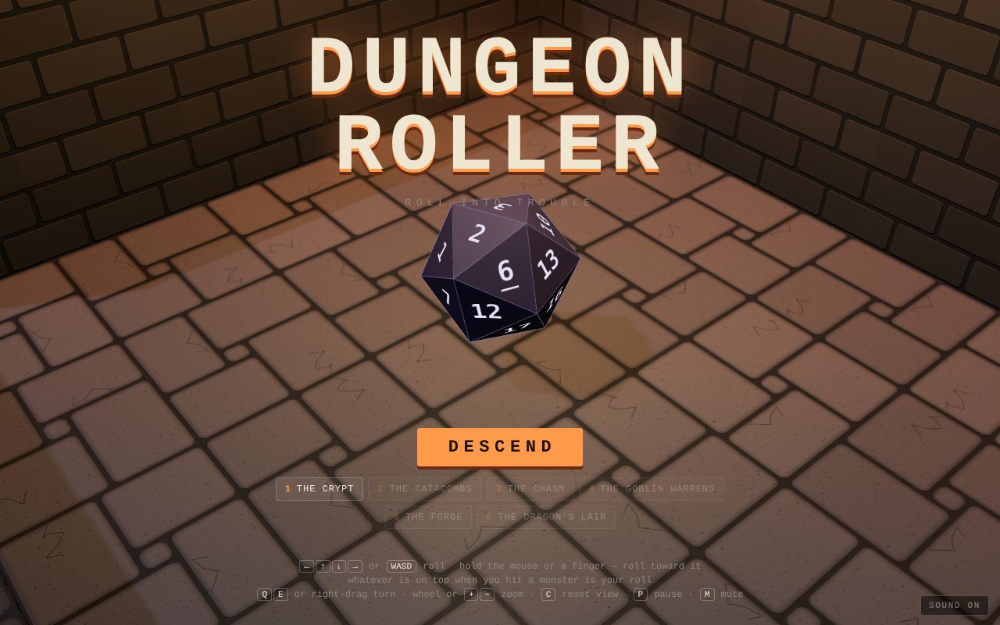
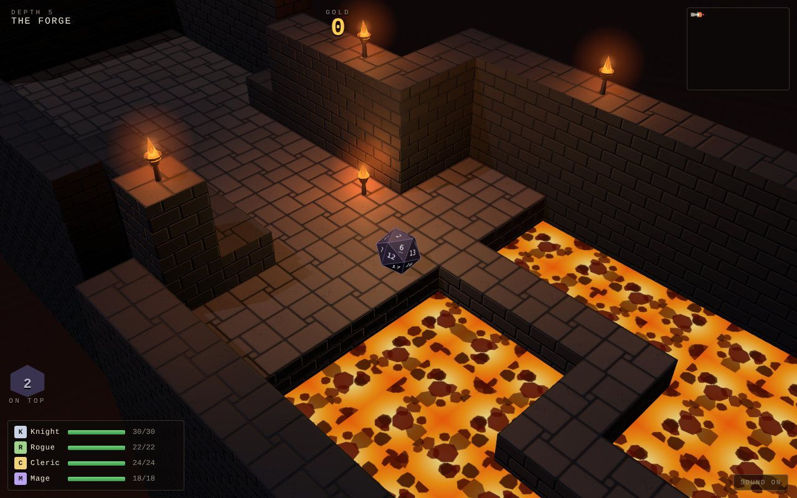
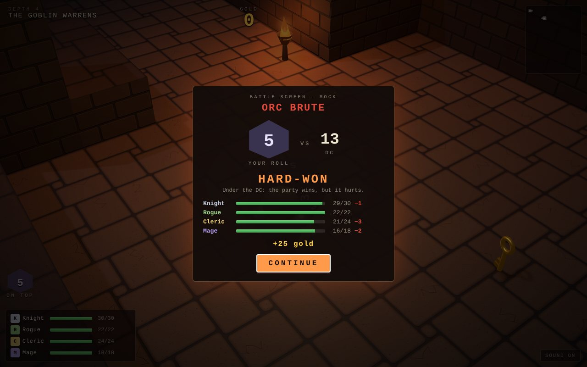
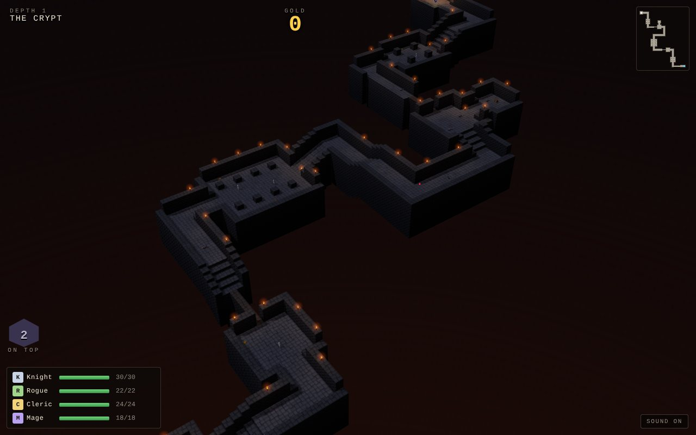

# Dungeon Roller

A rolling dungeon crawler. You roll a d20 down through six long, torchlit
dungeons, Marble Madness-style. The die is your party of four heroes. Roll
into a monster and whatever number is on top of the die is the roll the
party fights with.

The die is [Nat](https://github.com/h1ddenpr0cess20/nat)'s d20: the same
purple resin, inked edges and numbers. Everything else comes from
[Madness](https://github.com/h1ddenpr0cess20/madness): the renderer, the
physics, the tiled courses, the camera and the controls. The courses are
turned into dungeons with walls, stairs and lava, and each level runs a good
deal longer than a Madness race.





## Run

```sh
git clone https://github.com/h1ddenpr0cess20/dungeon-roller
cd dungeon-roller
npm install
npm run dev               # → http://localhost:5173
```

There's no server and no keys: it's a static page. `npm run build` puts it in
`dist/`, which runs from any folder or path.

## Play

| | |
|---|---|
| <kbd>←</kbd><kbd>↑</kbd><kbd>↓</kbd><kbd>→</kbd> or <kbd>WASD</kbd> | Roll. The dungeons run diagonally across the screen, so hold two at once. |
| Hold the mouse or a finger | Roll toward the pointer. The further it is from the die, the harder the push. |
| <kbd>Q</kbd> <kbd>E</kbd>, or drag with the right mouse button | Turn the view. Dragging up and down tilts it. |
| Mouse wheel, or <kbd>+</kbd> <kbd>−</kbd> | Zoom. |
| Two fingers | Pinch to zoom, twist to turn, drag up or down to tilt. |
| <kbd>C</kbd> | Put the view back. |
| <kbd>Enter</kbd> / <kbd>Space</kbd> | Carry on after a fight. |
| Gamepad | Left stick or d-pad rolls; right stick turns and tilts; shoulder buttons zoom; <kbd>A</kbd> starts and carries on, <kbd>Start</kbd> pauses. |
| <kbd>P</kbd> / <kbd>Esc</kbd> | Pause. |
| <kbd>M</kbd> | Sound on or off. |

### The roll

The die rolls as a ball but turns as a d20. It tips over its edges and wanders
a little off the line you roll it along, so every number comes up. When it
stops, it settles onto its nearest face. The number on top is shown beside
the party the whole time. Whatever is on top at the moment you hit a monster
is your roll. A 20 shines gold and a 1 burns red.

### Fights: a stand-in for now

Hitting a monster opens the battle screen. For now it is a mock: the roll is
checked against the monster's DC, and that one comparison decides the fight.

| Roll | | What it costs |
|---|---|---|
| 20 | **Critical** | Nothing, and the monster's gold is doubled. |
| DC or better | **Victory** | Half the monster's power at the DC, one point less for every point over, down to nothing. |
| under the DC | **Hard-won** | Half its power, plus a third of how far under, rounded up. |
| 1 | **Fumble** | Twice its power. |

The party always wins for now. Damage is spread a point at a time over the
heroes who are still standing: the Knight in front takes the most and the
Mage at the back the least. The real battle screen replaces `resolveBattle`
and `createBattleScreen` in `src/battle.js`. The game only needs `damage` and
`gold` back from it.

A full turn-based system is also built and tested: a port of capitol-quest's,
with skills, MP, LIMIT, weaknesses that BREAK, items, levels and
auto-battle. For now it is shelved. [docs/battle-system.md](docs/battle-system.md)
covers its rules, what is left to do, and how to bring it back from the
patch kept in `docs/battle-port/`.



### The party

The Knight, Rogue, Cleric and Mage. Their hit points carry from level to
level. Falling into the dark, getting crushed, burnt or spiked, and landing
from too high all hurt them. Potions heal everyone still standing. At the
stairs down, the party rests: anyone who fell gets back up, and everyone
gets half their hit points back. When all four are down, the run is over.
Gold is the score, and the title screen keeps the best.

### The dungeons

| | Depth | What's in it |
|---|---|---|
| The Crypt | 1 | Halls and crypts with pillars, ledges with no wall on the open side, a bridge one tile wide, rats, skeletons and a bat. A treasure nook off the side. |
| The Catacombs | 2 | Crushers, spikes, oozes going round the ossuary, and a portcullis. Its key is up a side passage, under more spikes. |
| The Chasm | 3 | Platforms that ferry you across the gaps, platforms that sink down shafts, a zig-zag bridge one tile wide, and a goblin roost. |
| The Goblin Warrens | 4 | Two gates and two keys, spike runs, a twisting burrow one tile wide, a fungus cavern, goblins, rats and orcs. |
| The Forge | 5 | Rooms flooded with lava with paths across them, a slag channel, stepping stones, crushers over a bridge, wraiths and orcs. |
| The Dragon's Lair | 6 | A bit of everything, and then the hoard. The dragon lies across the last way out. |



Down there:

- **Monsters.** Rats, skeletons, goblins and orc brutes walk. They come for
  you when you get near and go home when you get away, and they won't follow
  you off an edge. Oozes crawl a set loop. Bats and wraiths fly a loop, over
  gaps and all. A beaten monster drops its gold.
- **Crushers.** Stone blocks that climb slowly, wait, then slam down.
- **Spikes.** Out of the floor for a moment, now and then. The rusty tiles
  show where.
- **Lava.** It burns the die.
- **Platforms.** Ferries go back and forth across gaps, and lifts go down
  shafts. They wait at each end.
- **Portcullises.** Roll into one with a key and it lifts.
- **Gold, chests, potions and keys.** Roll over them to pick them up.

The map in the corner shows what you have seen so far, and any monster near
you.

## How it's made

| | |
|---|---|
| `src/vendor/gfx/` | Alan's renderer, as Madness has it. It uses WebGPU where the browser has it and WebGL 2 where it doesn't (`?renderer=webgl` pins it). |
| `src/nat/geometry.js` | Nat's d20, copied from `nat/src/client/nat/geometry.js`. The only change is a guard so the tests can number the faces under node. |
| `src/die.js` | Turns the die as it rolls, and settles it onto a face. Also works out which number is on top. Everything is plain arrays at the physics rate, so the tests roll the same numbers as the screen. |
| `src/physics.js` | Madness's ball physics, unchanged. |
| `src/dungeon.js` | Tiles with four corner heights, as Madness's courses have. Adds walls, lava, the stairs down, and torchlight baked into the stone. It builds both the meshes and the collision triangles. |
| `src/dig.js` | Digs a level out a piece at a time: `hall`, `room`, `turn`, `stairs`, `ramp`, `ledge`, `bridge`, `chute`, `ferry`, `shaft`, `exit`. A cursor keeps every piece meeting the last. |
| `src/levels.js` | The six levels. |
| `src/monsters.js` | What each monster does and how it looks. |
| `src/actors.js` | Everything that moves or can be picked up: monsters, crushers, spikes, platforms, portcullises and treasure. |
| `src/delve.js` | One level with nothing drawn: the rules for falling, burning, fights, keys and the stairs. The game draws it; the tests drive it. |
| `src/party.js` | The four heroes and their hit points. |
| `src/battle.js` | The stand-in battle. |
| `src/audio.js` | Every sound, synthesised with Web Audio. |

| Script | |
|---|---|
| `npm run dev` | Vite dev server |
| `npm run build` | Bundles to `dist/` |
| `npm run preview` | `build`, then serves `dist/` |
| `npm test` | `node:test`. Covers the physics, the dungeon builder and digger, the die, the mock battle, the party, the monsters and traps, and the rules. An autopilot plans its own way through every level. It has to get the party down the stairs alive, without losing the die once, and take more than a minute doing it. |
| `npm run lint` | ESLint |
| `node scripts/map.js 3` | Prints a level as text, for laying one out (`--heights` for the floor heights). |

The renderer is three.js-shaped but isn't three.js; see
`src/vendor/gfx/LICENSE` for what it ports from it.
